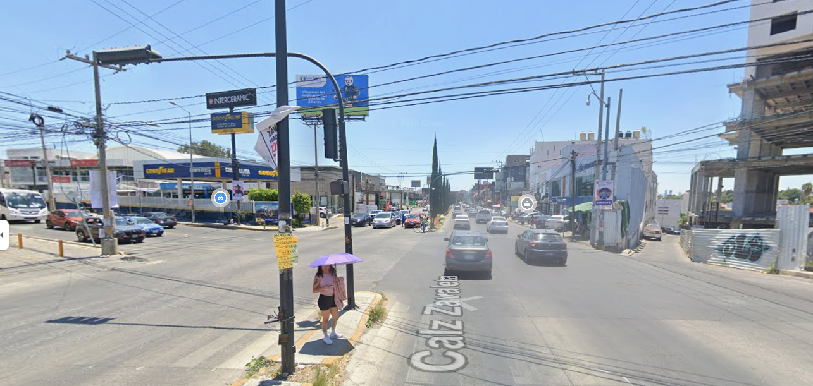
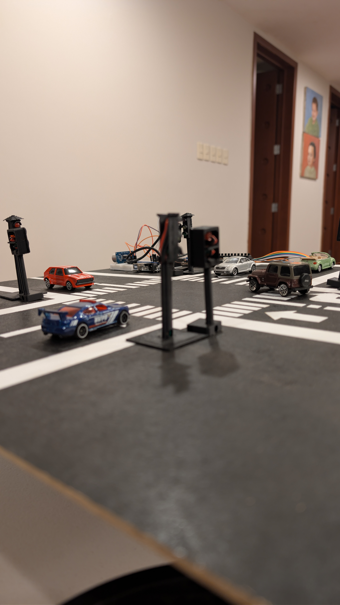
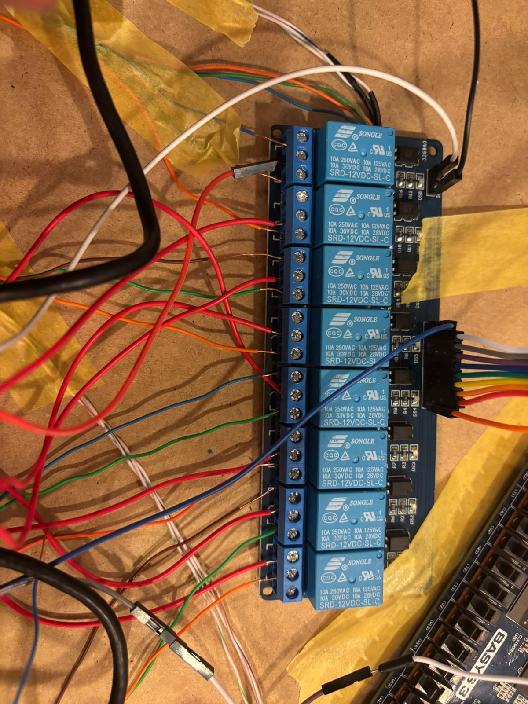

# Proyecto: Cruce de Semaforos


El proyecto consiste en la creación de un programa basado en una FPGA (Field-Programmable Gate Array) y una placa de microcontrolador Arduino, y la implementación del programa en una maqueta funcional.
La maqueta está formada en forma de un crucero de 4 semáforos, basada en las intersecciones que se pueden encontrar en la Calzada Zavaleta, Puebla.



---

## 📋 Requisitos Previos

- Manejo de VHDL y Arduino.

- Manejo de componentes y circuitos básicos

- Manejo de herramientas básicas

- Las herramientas necesarias fueron:

    - Impresora 3D

    - Cautín

    - Pistola de calor

    - Taladro

    - Pinzas

- Los componentes usados fueron:

    - Resistencias de 330 &Omega; (ohms)
    - LEDs color verde
    - LEDs color amarillo
    - LEDs color rojo
    - Relés
    - Basys 3
    - Arduino Uno
    - Sensor Ultrasónico
    - Buzzer


- El software necesario es:

    - Ultimaker Cura (o mejores)

    - Vivado

    - EDA Playground

    - Arduino IDE

---

## 📖 Introducción

Explicación del propósito del proyecto, para qué sirve, posibles aplicaciones y motivación para construirlo.

---

## 🔩 Materiales

Lista detallada de componentes y materiales con cantidades aproximadas:

- 20x Resistencias de 330 &Omega; (ohms)

- 8x diodos emisores de luz (LEDs) color verde

- 4x diodos emisores de luz (LEDs) color amarillo

- 8x diodos emisores de luz (LEDs) color rojo

- 2x placas de 8 relés de 12 V

- Basys 3

- Arduino Uno

- Sensor Ultrasónico Hc-sr04

- Buzzer de 2 pines

---
## 💾 Instalación de Software

Para Arduino:

- Instalar el IDE

Para Vivado:

- Crear cuenta de AMD

- Pasar filtros de seguridad y solicitar licencia

- Usar instalador

Para Ultimaker:

- Instalar por medio del paquete de instalación
---

## ⚙️ Montaje y Ensamblado

**Paso 1:** Encontrar y determinar el diseño a considerar para la creación de la maqueta

**Paso 2:** Determinar dimensiones y colocación de los sistemas

**Paso 3:** Hacer pruebas básicas sobre el funcionamiento de los sistemas, una vez conectados a la FPGA 


**Paso 4:** Revisar para errores en hardware y software (debugging)

**Paso 5:** Hacer el armado básico de las carcasas de los sistemas y volver a probar para encontrar fallas o errores


**Paso 6:** Hacer la instalación general para revisar tamaño de cables y planear organización



**Paso 7:** Hacer las conexiones ordenadas del sistema, asegurando una organización y reduciendo peligros de cortos



**Paso 8:** Realizar ensamble final y hacer la prueba de funcionalidad completa


**Paso FINAL** Presentarselo a tu profesor


### 🔌 Conexiones Eléctricas

Diagrama esquemático y tabla de conexiones entre componentes:

---

## 💻 Programación

**1. Tiempos y Velocidad (GENERIC)**

Esta es la sección más común para realizar ajustes rápidos sin tocar la lógica compleja. Se encuentra al inicio de la entity.

```vhdl
generic (
    C_DIVISOR : natural := 2500000;  -- Define la velocidad del "Tick" (0.05s)
    C_GREEN_TICKS : natural := 100;  -- Duración de la luz Verde
    C_YELLOW_TICKS : natural := 40;  -- Duración de la luz Amarilla
    C_RED_STATE_TICKS : natural := 100 -- Duración del modo STOP
);
```

¿Cómo modificarlo?

Para hacerlo más lento/rápido en general: Aumenta o disminuye C_DIVISOR.

Para cambiar la duración de las luces: Modifica los valores de C_GREEN_TICKS o C_YELLOW_TICKS. Recuerda que estos números son multiplicadores del "Tick". (Ej: 100 ticks * 0.05s = 5 segundos).

**2. Entradas y Salidas (PORT)**

Aquí se definen las conexiones físicas del chip hacia el mundo exterior (Relés, Arduino, Buzzer).

```vhdl
Port ( 
    -- Entradas
    CLK, RESET, BTN_STOP : in STD_LOGIC;
    ARDUINO_ALERT : in STD_LOGIC; -- Nueva entrada de sensor

    -- Salidas
    N_YELLOW, N_GREEN : out STD_LOGIC; -- Semáforo Norte
    OUT_BUZZER : out STD_LOGIC;        -- Salida de Audio
    ...
);
```

Nota Importante: Si agregas una nueva entrada o salida aquí, debes asignarle un pin físico en el archivo .xdc, o Vivado dará error.

**3. La Máquina de Estados (PROCESO 2)**

Este es el "cerebro" del código. Define el orden en que suceden las cosas.

A. Definición de Estados

Se encuentra en la arquitectura, antes del begin.

```vhdl
type t_traffic_state is (
    ST_N_GREEN, ST_N_YELLOW,  -- Norte
    ST_S_GREEN, ST_S_YELLOW,  -- Sur
    ST_E_GREEN, ST_E_YELLOW,  -- Este
    ST_W_GREEN, ST_W_YELLOW   -- Oeste
);
```

Si quieres cambiar el orden de encendido (ej. que después del Norte siga el Este en vez del Sur), debes cambiar el orden en la lógica del case dentro del Proceso 2.

B. Lógica de Transición (Sticky Logic)

Aquí es donde detectamos si el Arduino o el botón piden parada. Usamos lógica "Sticky" (pegajosa) para no perder la señal si el ciclo va a la mitad.

```vhdl
if ARDUINO_ALERT = '1' or BTN_STOP = '1' then
    s_stop_request <= '1'; -- Se guarda la petición
end if;
```

Si quieres agregar otro sensor (ej. SENSOR_PEATON), solo añádelo a esta condición or.

**4. Lógica de Salidas (PROCESO 3)**

Aquí es donde decides qué luces se prenden en cada estado. Es la "traducción" del estado lógico a electricidad.

```vhdl
case s_traffic_state is
    when ST_N_GREEN =>  N_GREEN <= '1'; -- Solo prende el verde Norte
    when ST_N_YELLOW => N_YELLOW <= '1';
    ...
end case;
```

Modificación Común: Si quieres que en el estado de STOP (Blackout) se prenda una luz específica (ej. todas las amarillas parpadeando o todas las rojas), debes modificar la sección when ST_STOP_MODE => dentro de este proceso. Actualmente está en null (todo apagado).

**5. El Buzzer (PROCESO 3 - Sección Especial)**

El buzzer tiene una lógica independiente del estado del semáforo. Responde directamente a la entrada.

```vhdl
if ARDUINO_ALERT = '1' then
    OUT_BUZZER <= '1'; -- Sonido continuo
else
    OUT_BUZZER <= '0';
end if;
```

Si quieres que el buzzer suene intermitente (beep-beep), necesitarás reintroducir un contador o usar la señal s_tick para modular la salida.

**6. Display de 7 Segmentos (PROCESO 4 y 5)**

Controla la cuenta regresiva visual.

Fórmula Matemática: v_calc_temp := 9 - (s_red_counter * 9 / C_RED_STATE_TICKS);

Esta línea asegura que, sin importar cuánto dure el tiempo de parada (5s o 20s), la cuenta siempre irá de 9 a 0 proporcionalmente.

---

## ✅ Conclusión

Resumen de lo que se logró construir, aprendizajes obtenidos y posibles mejoras o versiones futuras del proyecto.

---

## 🔜 Mejoras futuras

- Mejorar el código para establecer tiempos variables por cada semáfor

- Establecer mejores conexiones

- Mejorar la accesibilidad al mantenimiento

- Independizar cada parte del circuito para su cambio

## ⚠️ Advertencia

Como se indica en la licencia MIT, este software/hardware se proporciona **sin ningún tipo de garantía**. Por lo tanto, ningún colaborador es responsable de **cualquier daño a tus componentes, materiales, PC, etc..**.

---

## 📚 Recursos Adicionales

---

## 👥 Autores del proyecto

Juan Pablo Lopez Moreno

Amy Marianee Ramírez Sánchez

---

## 📬 Contacto

¿Tienes dudas o sugerencias?

- 📧 Correo electrónico: juan.lopezmo@udlap.mx

---

